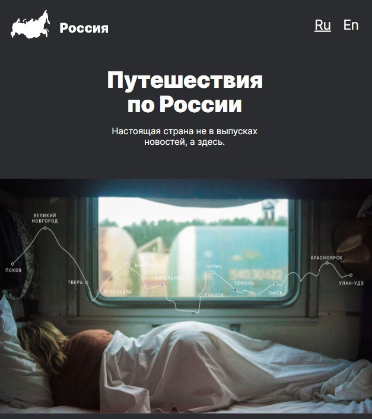
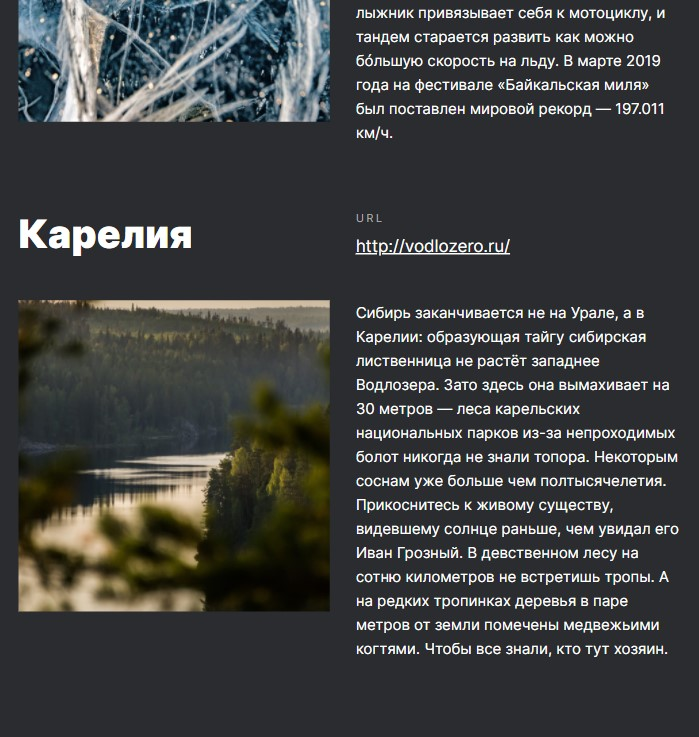

# :train: A landing about curious places in Russia

A study project at Practicum by Yandex to try:

- CSS, HTML, adaptive layout
- Grid, Flexbox
- BEM

---

## :mag_right: Preview

---

## :link: Link to test

[GitPages](https://dianadomino24.github.io/russian-travel/)

---

## :rocket: Technologies

-   **JavaScript ES6** - scroll counter

-   semantic **HTML5**, styles - **CSS3** including Flexbox, Grid
-   **adaptive**, responsive layout
-   **BEM**
-   **Figma**, Pixel Perfect.

[Figma layout](https://www.figma.com/file/OyRWEjU6wBwRe1hapzQoLx/Sprint-3%3A-Russia-%2F-desktop-%2B-mobile?node-id=28503%3A0)

---

**Practicum by Yandex** - https://practicum.yandex.com/

---

## :sparkles: Thanks for watching!
